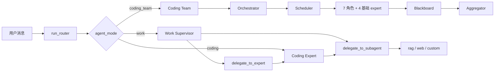

# AgentX

本地优先的个人助理桌面应用 — Tauri 2.x + React + FastAPI + LangGraph。
桌面 GUI 与终端 CLI **同源同配置**，二选一自由切换。


## 功能清单

- **三种场景 agent**：`work`（全能 Supervisor）/ `coding`（专家）/ `coding_team`（多代理协作），按 `agent_mode` 单字段路由
- **`@mention` 强制委派**：输入 `@coding` / `@rag` / `@web` 覆盖 LLM 自主决策
- **人在回路审批**：危险工具 + 目录越界双类型，决策支持 `approve` / `once` / `session` / `deny`
- **长期记忆**：LangGraph `SqliteSaver` + 技能注入（`@skill:<name>`）+ 用户画像持久化
- **流式响应**：FastAPI SSE + `astream_events` v2，回传 token / reasoning / tool_call / approval_request / team_* 全事件
- **可观测**：LangSmith + Langfuse + 4 维 Observation Store（Run / Event / Tool call / Feedback）
- **Coding Team**：Orchestrator + 7 角色并行（frontend_dev / backend_dev / tester / architect / devops / ui_designer / product_manager）+ Blackboard + Aggregator + `_quality_gate`
- **配置热更新**：Tauri store 持久化 + LRU 清理，改完即时生效

## 技术栈

| 层 | 技术 |
|---|---|
| 桌面壳 | Tauri 2.x + Rust 1.77+（tokio） |
| 前端 UI | React 18 + TypeScript + Tailwind v4 + zustand |
| 后端 API | FastAPI + Uvicorn |
| AI 编排 | DeepAgents → LangGraph `StateGraph` → LangChain（按优先序退化） |
| 智能体分层 | `scenarios/{work,coding,coding_team}/` + `subagents/` + `team/` |
| 向量 / 嵌入 | Milvus + TEI BGE-M3 |
| 检查点 | LangGraph `SqliteSaver` / `AsyncSqliteSaver` |
| 观测 | LangSmith + Langfuse + loguru |
| 依赖管理 | 前端 npm + Vite 5，Rust cargo，后端 uv |

## 架构与运行模式

### 整体流程



### Router 场景分发

聊天主入口 [router/graph.py::run_router](file:///d:/java/agentprojects/agentx/backend/app/router/graph.py) 按 `agent_mode` 直接分发（不再做消息分类），CLI 与 GUI 共用：

| `agent_mode` | 执行体 | 文件 |
|---|---|---|
| `"work"` | `run_work_supervisor` 全能 Supervisor，可委派 Expert / 子代理 | [scenarios/work/agent.py](file:///d:/java/agentprojects/agentx/backend/app/scenarios/work/agent.py) |
| `"coding"` | `run_coding_expert` 基于 `build_deep_agent` + 审批 | [scenarios/coding/agent.py](file:///d:/java/agentprojects/agentx/backend/app/scenarios/coding/agent.py) |
| `"coding_team"` | `run_coding_team` Orchestrator + 并行 Expert + Blackboard + Aggregator | [scenarios/coding_team/agent.py](file:///d:/java/agentprojects/agentx/backend/app/scenarios/coding_team/agent.py) |

入站关键步骤：① 校验 `agent_mode` → ② 解析 `@skill:<name>`（仅 `work`）→ ③ 同步 workspace 授权 + `revoked_paths` → ④ 加载 profile + `.agentx/system_prompt.md` → ⑤ 加载并截断历史 messages → ⑥ 按 `agent_mode` 分发 → ⑦ `ainvoke` 写回 checkpointer → ⑧ `yield done` 收口。

### 三种执行体

| 维度 | Work Supervisor | Coding Expert | Coding Team |
|---|---|---|---|
| 工具集 | fs + git + cli + rag + web + 委派 + `@mention` | fs + git + cli + rag + web + `delegate_to_subagent`（不可委派 Expert） | 7 角色 + 4 基础 expert |
| 委派能力 | `delegate_to_expert` + `delegate_to_subagent` | 仅 `delegate_to_subagent` | 内置平行调度 |
| 危险工具 | `FORBIDDEN_SUBAGENT_TOOLS` + `interrupt_before=["tools"]` 审批 | `runtime_dangerous = (DANGEROUS_TOOLS ∩ enabled) ∪ mcp_untrusted` | 写 / 改 / shell 任务强制拆为 `agent=deep` 子任务走 Coding Expert |
| 防失控 | — | `readonly_streak_threshold=10` 强中断只读工具连续调用 | `_quality_gate` 拒全失败 / 全相同 / 全截断 |

### Subagent 与委派

[backend/app/subagents/](file:///d:/java/agentprojects/agentx/backend/app/subagents/) 提供基础子代理（公共工具构造见 [base.py](file:///d:/java/agentprojects/agentx/backend/app/subagents/base.py)，闭包绑定 `thread_id` 隔离上下文）：

| Subagent | 工具集 | 备注 |
|---|---|---|
| **rag** | `rag_retrieve` | 绑定 `thread_id` |
| **web** | `web_search` | Tavily；缺 `AGENTX_TAVILY_API_KEY` 时中文降级 |
| **custom_agent** | `custom_subagents.<key>.tools` | 自动过滤 `FORBIDDEN_SUBAGENT_TOOLS` |

Supervisor 暴露两条委派工具：`delegate_to_expert(expert_name, task, context="")` 与 `delegate_to_subagent(agent_name, task)`；`@mention` 解析见 [scenarios/work/mention.py](file:///d:/java/agentprojects/agentx/backend/app/scenarios/work/mention.py)。

### Coding Team 多代理协作

**七大角色**（[team/planner.py::_build_team_experts_description](file:///d:/java/agentprojects/agentx/backend/app/team/planner.py#L49)）：

| Key | 职责 |
|---|---|
| `frontend_dev` | React / Vue / HTML / CSS / JS / TS、组件开发、性能优化 |
| `backend_dev` | Python / Java / Go / Node.js、API、数据库、业务逻辑 |
| `tester` | 单元 / 集成 / E2E、测试框架、覆盖率 |
| `architect` | 系统设计、技术选型、性能、微服务架构 |
| `devops` | CI / CD、Docker / K8s、部署流水线、监控告警 |
| `ui_designer` | 界面设计、交互设计、视觉规范、UX |
| `product_manager` | 需求分析、PRD、用户故事、功能规划 |

**四大核心模块**：

- **Orchestrator**（[team/orchestrator.py](file:///d:/java/agentprojects/agentx/backend/app/team/orchestrator.py)）— LLM 拆任务，危险关键词强制改写为 `deep`；支持纯 JSON / markdown 代码块 / 前后文本三种 plan 形态
- **Scheduler**（[team/scheduler.py](file:///d:/java/agentprojects/agentx/backend/app/team/scheduler.py)）— `asyncio.Queue` + `Semaphore(max_parallel)`，按 `task.agent` 分发；子任务 `thread_id = "{parent}-team-{role}-{idx}"` 隔离
- **Blackboard**（[team/blackboard.py](file:///d:/java/agentprojects/agentx/backend/app/team/blackboard.py)）— `findings / errors / meta` 聚合，供 Aggregator prompt 文本化
- **Aggregator**（[team/aggregator.py](file:///d:/java/agentprojects/agentx/backend/app/team/aggregator.py)）— 流式综合输出，含 `_quality_gate` 质量门

### 工具与扩展

[backend/app/tools/](file:///d:/java/agentprojects/agentx/backend/app/tools/) + [subagents/base.py](file:///d:/java/agentprojects/agentx/backend/app/subagents/base.py) 暴露 14 项内置工具：

| 类别 | 工具 |
|---|---|
| **filesystem** | `read_file` / `list_dir` / `glob` / `grep` / `write_file` / `edit_file` |
| **git** | `git_status` / `git_diff` / `git_log` / `git_branches` / `git_clone` / `git_pull` / `git_checkout` / `git_stage` / `git_commit` |
| **cli** | `cli_execute`（命令黑名单 + 元字符过滤 + 关键目录拦截） |
| **rag** | `rag_retrieve`（TEI BGE-M3 嵌入 + Milvus HNSW 检索） |
| **web** | `web_search`（Tavily） |

子代理严格过滤 `FORBIDDEN_SUBAGENT_TOOLS`，写权限仅留给 Supervisor / Coding Expert；沙箱授权目录管理由 [backend/app/sandbox/](file:///d:/java/agentprojects/agentx/backend/app/sandbox/) 统一承担，危险工具走 `interrupt_before=["tools"]` 审批流。

### 记忆与检查点

| 模块 | 文件 | 作用 |
|---|---|---|
| checkpointer | [memory/checkpointer.py](file:///d:/java/agentprojects/agentx/backend/app/memory/checkpointer.py) | `SqliteSaver` + `AsyncSqliteSaver` 持久化到 `data/agentx.db`，按 `thread_id` 隔离 |
| skills | [skills_loader.py](file:///d:/java/agentprojects/agentx/backend/app/memory/skills_loader.py) + [skills_store.py](file:///d:/java/agentprojects/agentx/backend/app/memory/skills_store.py) | YAML frontmatter + Markdown，目录 `data/skills/<name>/SKILL.md`，由 deepagents `skills=` 自动接管 |
| profile | [profile_store.py](file:///d:/java/agentprojects/agentx/backend/app/memory/profile_store.py) | 持久化用户画像到 `data/config/profile.json`，按 `updated_at` 取前 30 条 |
| summarizer | [summarizer.py](file:///d:/java/agentprojects/agentx/backend/app/memory/summarizer.py) | 摘要中间件控制 token 预算 |

## 观测 / 反馈 / 复盘

围绕 16 字符 `trace_id` 贯穿的 4 维 Observation Store（`data/agent_observation.db`）：

| 维度 | 内容 | 表 |
|---|---|---|
| Run | chat 元数据（thread_id / agent_mode / duration_ms / error） | `observation_run` |
| Event | 每条 SSE 事件的 payload | `observation_event` |
| Tool call | 审批回填（auto_approve / user_approved / user_rejected） | `observation_tool_call` |
| Feedback | 显式 👍/👎 + 评论 + 隐式信号（abort / deny） | `observation_feedback` |

REST API（base path `/api/observation`）共 5 个端点：`POST /feedback` · `GET /feedback?run_id=` · `GET /runs?thread_id=&limit=` · `GET /runs/{run_id}` · `GET /runs/{run_id}/events`。

**复盘 → 评测闭环**：

```bash
agentx eval export-feedback --days=30 --output-dir=tests/eval/suites/   # 👎 → EvalSuite YAML
agentx eval run --suite feedback-YYYYMMDD --mock                        # Replay 离线回放
```

TTL 自动清理：超 `AGENTX_OBSERVATION_TTL_DAYS`（默认 30）的 run / event / tool_call 自动清理；`observation_feedback` 永久保留。

## 快速开始

> 本项目所有 AI 代理 / 开发者 / 自动化脚本 **必须**通过 [scripts/](file:///d:/java/agentprojects/agentx/scripts/) 下的启停脚本操作 dev session，**禁止**手动 `pnpm tauri dev` / `Stop-Process`（原因见 [docs/agents/04-restart-sop.md](file:///d:/java/agentprojects/agentx/docs/agents/04-restart-sop.md) §14.7.8）。

| 操作 | 命令 |
|---|---|
| 启动（前台） | `agentx-start` |
| 后台启动 | `agentx-start -NoWait` |
| 停止 | `agentx-stop` |
| 重启 | `agentx-restart` |
| 健康探测 | `agentx-health` |

Windows 也可直接：`pwsh scripts/start.ps1` / `stop.ps1` / `restart.ps1` / `health-check.ps1`。

## 文档导航

- 工程文化规范：[AGENTS.md](file:///d:/java/agentprojects/agentx/AGENTS.md)（核心原则、技术栈、反面清单、决策流程）
- Claude 工作手册：[claude.md](file:///d:/java/agentprojects/agentx/claude.md) → [docs/agents/](file:///d:/java/agentprojects/agentx/docs/agents/)（架构地图 / SSE 契约 / 关键约定 / 重启 SOP / 前端命名）
- OpenSpec 变更：[openspec/changes/](file:///d:/java/agentprojects/agentx/openspec/changes/)
# AgentX

本地优先的个人助理桌面应用，基于 Tauri 2.x + React + FastAPI + LangGraph 构建。
同时提供 **Tauri 桌面 GUI** 与 **终端 CLI** 两种入口，二者配置完全共享。


# Replay (mock 模式离线)
agentx eval run --suite feedback-YYYYMMDD --mock
```

**TTL 自动清理**：超 `AGENTX_OBSERVATION_TTL_DAYS`（默认 30）的 run/event/tool_call 自动清理；`observation_feedback` 永久保留（与 run 解耦）。
