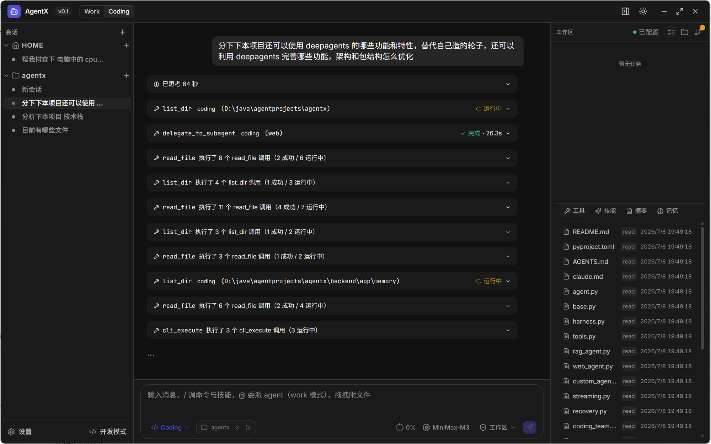
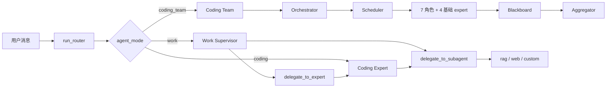

# AgentX

本地优先的个人助理桌面应用，基于 Tauri 2.x + React + FastAPI + LangGraph 构建。
同时提供 **Tauri 桌面 GUI** 与 **终端 CLI** 两种入口，二者配置完全共享。



## 功能清单

- **双端入口**：[Tauri 桌面 GUI](#) + [终端 CLI `agentx`](#)，同一份 Tauri store 配置互用
- **场景化多智能体架构**：Work Supervisor（全能）+ Coding Expert（专家）+ Coding Team（多代理协作）+ Subagent（rag / web / 自定义）
- **`agent_mode` 单字段三态**：`work` / `coding` / `coding_team`，Router 按场景直接分发，不再做消息分类
- **人在回路审批**：危险工具 + 目录越界扩展双类型审批，决策 `approve` / `once` / `session` / `deny`；支持 GUI 弹窗 + 终端阻塞输入
- **长期记忆**：LangGraph `SqliteSaver` 会话检查点 + 技能（消息中 `@skill:<name>` 注入）+ 用户画像持久化
- **工具与扩展**：14 项内置工具（filesystem + web_search + rag_retrieve + git_* + cli_execute）+ RAG 检索（Milvus + TEI BGE-M3）+ MCP 协议（stdio / sse / streamable_http）+ 自定义子代理
- **流式响应**：FastAPI `StreamingResponse` + LangChain `astream_events`，实时回传 token / reasoning / tool_call / tool_result / delegation / approval_request / plan / team_* 等事件
- **观测**：LangSmith trace + Langfuse + loguru 结构化日志
- **配置热更新**：Tauri store 持久化 + LRU 缓存清除，配置变更即时生效（无需重启后端）
- **Coding Team 多代理协作**：Orchestrator 拆解 + 并行 Expert（frontend_dev / backend_dev / tester / architect / devops / ui_designer / product_manager）+ Blackboard + Aggregator

## 技术栈

| 层 | 技术 |
|---|---|
| 桌面壳 | Tauri 2.x + Rust 1.77+（tokio async runtime） |
| 前端 UI | React 18 + TypeScript + Tailwind CSS v4 + zustand |
| 主进程 | Rust（10 个官方插件 + `commands/<domain>.rs`） |
| 后端 API | FastAPI + Uvicorn |
| AI 编排 | LangGraph `StateGraph` + DeepAgents + LangChain |
| 智能体分层 | `agents/{supervisor,expert,team}/` 场景化执行体 + `subagents/` 轻量子代理 |
| 向量存储 | Milvus（TEI BGE-M3） |
| 检查点 | LangGraph `SqliteSaver` / `AsyncSqliteSaver` |
| 观测 | LangSmith + Langfuse + loguru |
| 依赖管理 | 前端 npm + Vite 5，Rust cargo，后端 uv + pyproject.toml |

## 架构与运行模式

### 整体流程



### Router 场景分发

聊天主入口 [backend/app/router/graph.py::run_router](file:///d:/java/agentprojects/agentx/backend/app/router/graph.py)
按 `agent_mode` **直接分发**到对应场景执行体（不再做消息分类），CLI 与 GUI **共用此入口**：

| `agent_mode` | 执行体 | SSE source | 文件 |
|---|---|---|---|
| `"work"` | `run_work_supervisor`（全能 Supervisor，可委派 Expert / 子代理） | `work` | [scenarios/work/agent.py](file:///d:/java/agentprojects/agentx/backend/app/scenarios/work/agent.py) |
| `"coding"` | `run_coding_expert`（基于 `build_deep_agent` + 审批） | `coding` | [scenarios/coding/agent.py](file:///d:/java/agentprojects/agentx/backend/app/scenarios/coding/agent.py) |
| `"coding_team"` | `run_coding_team`（Orchestrator + 并行 Expert + Blackboard + Aggregator） | `coding_team` | [scenarios/coding_team/agent.py](file:///d:/java/agentprojects/agentx/backend/app/scenarios/coding_team/agent.py) |

`run_router` 八步流程：

1. **校验 `agent_mode`** — 合法集合 `{"work", "coding", "coding_team"}`，非法值 yield `error` + `done` 立即返回
2. **解析 `@skill:<name>` 标记** — 仅 `work` 场景将 skill content 注入 `profile_prompt`
3. **workspace 授权同步** — 优先用 `workspace_path`，回退到沙箱已授权 path；尊重 `revoked_paths`
4. **加载用户画像 + 项目级 system_prompt** — `build_profile_prompt()` + `.agentx/system_prompt.md` 异步前置
5. **加载历史 messages + 截断** — `context_max_messages` + token 预算 + `PatchToolCallsMiddleware` 修复
6. **按 `agent_mode` 分发** — 公共 `_collect_path_sse` 包装器收集 `token` 事件
7. **写回 checkpointer** — 最小 `StateGraph(MessagesState)` + `ainvoke`（兼容同步 `SqliteSaver`）
8. **统一 yield `done`** — 收口结束

### 三种执行体

**Work Supervisor** — 全能 ReAct Agent（[scenarios/work/agent.py](file:///d:/java/agentprojects/agentx/backend/app/scenarios/work/agent.py)）

- **工具集**：fs（读 + 写）+ git + cli + rag + web + **委派** + **`@mention` 强制委派**
- **委派能力**：`delegate_to_expert`（仅 `coding`）+ `delegate_to_subagent`（`{rag, web}` ∪ 自定义子代理）
- **审批**：`interrupt_before=["tools"]` 触发；`full_trust` 模式临时切换跳过审批

**Coding Expert** — 编码专家（[scenarios/coding/agent.py](file:///d:/java/agentprojects/agentx/backend/app/scenarios/coding/agent.py)）

- **工具集**：fs（读 + 写）+ git + cli + rag + web + **`delegate_to_subagent`**（不可委派 Expert）
- **`runtime_dangerous`** = `(DANGEROUS_TOOLS ∩ enabled) ∪ mcp_untrusted`
- **防过度探索**：`readonly_streak_threshold=10` 强制中断只读工具连续调用

**Coding Team** — 场景级 AgentTeam（[scenarios/coding_team/agent.py](file:///d:/java/agentprojects/agentx/backend/app/scenarios/coding_team/agent.py) 薄壳 → [team/orchestrator.py::run_team_path](file:///d:/java/agentprojects/agentx/backend/app/team/orchestrator.py)）

- Orchestrator 拆任务 → Scheduler 并行调度 → Blackboard 共享结果 → Aggregator 综合输出
- 涉及写 / 编辑 / shell 的任务强制拆为 `agent=deep` 子任务由 Coding Expert 执行

### Subagent 与委派

`backend/app/subagents/` 提供基础子代理（被 Supervisor / Coding Expert 调用）：

| Subagent | 文件 | 工具集 |
|---|---|---|
| **rag** | [rag_agent.py](file:///d:/java/agentprojects/agentx/backend/app/subagents/rag_agent.py) | 仅 `rag_retrieve`（绑定 `thread_id`） |
| **web** | [web_agent.py](file:///d:/java/agentprojects/agentx/backend/app/subagents/web_agent.py) | 仅 `web_search`（Tavily；缺 `AGENTX_TAVILY_API_KEY` 时中文降级） |
| **custom_agent** | [custom_agent.py](file:///d:/java/agentprojects/agentx/backend/app/subagents/custom_agent.py) | 按 `custom_subagents.<key>.tools` 组装（自动过滤 `FORBIDDEN_SUBAGENT_TOOLS`） |

公共工具构造见 [subagents/base.py](file:///d:/java/agentprojects/agentx/backend/app/subagents/base.py)，闭包绑定 `thread_id` 隔离上下文。

Supervisor 委派工具（[scenarios/work/agent.py](file:///d:/java/agentprojects/agentx/backend/app/scenarios/work/agent.py)）：

- `delegate_to_expert(expert_name, task, context="")` — 委派 Coding Expert
- `delegate_to_subagent(agent_name, task)` — 委派 rag / web / 自定义子代理

`@mention` 语法（`@coding` / `@rag` / `@web`）强制委派，覆盖 LLM 自主决策；解析在 [scenarios/work/mention.py](file:///d:/java/agentprojects/agentx/backend/app/scenarios/work/mention.py)。

### Coding Team 多代理协作

七大角色（[team/planner.py::_build_team_experts_description](file:///d:/java/agentprojects/agentx/backend/app/team/planner.py#L49)）：

| Key | 职责 |
|---|---|
| `frontend_dev` | React/Vue/HTML/CSS/JS/TS、组件开发、前端性能优化 |
| `backend_dev` | Python/Java/Go/Node.js、API 设计、数据库、业务逻辑 |
| `tester` | 单元/集成/E2E、测试框架、覆盖率 |
| `architect` | 系统设计、技术选型、性能优化、微服务架构 |
| `devops` | CI/CD、Docker/K8s、部署流水线、监控告警 |
| `ui_designer` | 界面设计、交互设计、视觉规范、UX |
| `product_manager` | 需求分析、PRD 撰写、用户故事、功能规划 |

四大核心模块：

- **Orchestrator**（[team/orchestrator.py](file:///d:/java/agentprojects/agentx/backend/app/team/orchestrator.py)）— LLM 拆任务，危险关键词强制改写为 `deep`；支持纯 JSON / markdown 代码块 / 前后文本三种 plan 形态
- **Scheduler**（[team/scheduler.py](file:///d:/java/agentprojects/agentx/backend/app/team/scheduler.py)）— 队列驱动（`asyncio.Queue` + `Semaphore(max_parallel)`），按 `task.agent` 分发；子任务 `thread_id = "{parent}-team-{role}-{idx}"` 隔离
- **Blackboard**（[team/blackboard.py](file:///d:/java/agentprojects/agentx/backend/app/team/blackboard.py)）— `findings / errors / meta` 聚合，供 Aggregator prompt 文本化
- **Aggregator**（[team/aggregator.py](file:///d:/java/agentprojects/agentx/backend/app/team/aggregator.py)）— 流式综合输出，含 `_quality_gate` 拒"全失败 / 全相同 / 全截断"

### 工具与扩展

[backend/app/tools/](file:///d:/java/agentprojects/agentx/backend/app/tools/) + [subagents/base.py](file:///d:/java/agentprojects/agentx/backend/app/subagents/base.py) 暴露 14 项内置工具：

- **filesystem**：`read_file` / `list_dir` / `glob` / `grep` / `write_file` / `edit_file`
- **git**：`git_status` / `git_diff` / `git_log` / `git_branches` / `git_clone` / `git_pull` / `git_checkout` / `git_stage` / `git_commit`
- **cli**：`cli_execute`（命令黑名单 + 元字符过滤 + 关键目录拦截）
- **rag**：`rag_retrieve`（TEI BGE-M3 嵌入 + Milvus HNSW 检索）
- **web**：`web_search`（Tavily）

子代理与自定义 agent 严格过滤 `FORBIDDEN_SUBAGENT_TOOLS`，写操作能力仅保留给 Supervisor / Coding Expert。沙箱授权目录管理由 [backend/app/sandbox/](file:///d:/java/agentprojects/agentx/backend/app/sandbox/) 统一承担，危险工具走审批流（详见 `agent_mode` 路由中的 `run_approval_loop`）。

### 记忆与检查点

- **checkpointer**（[memory/checkpointer.py](file:///d:/java/agentprojects/agentx/backend/app/memory/checkpointer.py)）— `SqliteSaver` + `AsyncSqliteSaver` 持久化到 `data/agentx.db`，按 `thread_id` 隔离会话
- **skills**（[memory/skills_loader.py](file:///d:/java/agentprojects/agentx/backend/app/memory/skills_loader.py) + [memory/skills_store.py](file:///d:/java/agentprojects/agentx/backend/app/memory/skills_store.py)）— YAML frontmatter + Markdown body，目录 `data/skills/<name>/SKILL.md`，由 deepagents `skills=` 参数自动接管
- **profile**（[memory/profile_store.py](file:///d:/java/agentprojects/agentx/backend/app/memory/profile_store.py)）— 持久化用户画像到 `data/config/profile.json`，按 `updated_at` 降序取前 30 条
- **summarizer**（[memory/summarizer.py](file:///d:/java/agentprojects/agentx/backend/app/memory/summarizer.py)）— 摘要中间件控制 token 预算

### 观测 / 反馈 / 复盘

围绕 `trace_id`（16 字符 hex）贯穿的 Agent Observation Store，提供 4 维度全链路可观测能力：

| 维度 | 内容 | 存储表 |
|---|---|---|
| **Run** | 一次 chat 请求的元数据（thread_id / agent_mode / user_message / final_prompt / result_text / duration_ms / error） | `observation_run` |
| **Event** | 每条 SSE 事件的 payload（含 tool_call args / LLM 输入输出） | `observation_event` |
| **Tool call** | 危险工具审批回填（auto_approve / user_approved / user_rejected） | `observation_tool_call` |
| **Feedback** | 显式 👍/👎 + 评论 + 隐式信号（auto_approve+success / abort / 审批 deny） | `observation_feedback` |

**前端 SSE 兼容性**：所有 JSON 事件 `data` 字段新增可选 `_tid`（与现有 `trace_id` 同值），旧前端忽略未知字段即可平滑升级。

**REST API（5 个端点，base path `/api/observation`）**：
| Method | Path | 用途 |
|---|---|---|
| `POST` | `/feedback` | 写 feedback（kind=thumb_up/thumb_down/rating/note/implicit_*），comment 写入前自动 redact |
| `GET` | `/feedback?run_id=` | 查指定 run 的 feedback 列表 |
| `GET` | `/runs?thread_id=&limit=` | 列 run（按 started_at 降序） |
| `GET` | `/runs/{run_id}` | 单 run 详情 + state_snapshot |
| `GET` | `/runs/{run_id}/events` | 按 seq 升序的事件流 |

**复盘 → 评测闭环**：
```bash
# 用户积累 30 天 👎 → 一键导出为 EvalSuite YAML
agentx eval export-feedback --days=30 --output-dir=tests/eval/suites/

# 自动写出 feedback-YYYYMMDD.yaml（每条 👎 → EvalCase with rubric = user comment）

# Replay (mock 模式离线)
agentx eval run --suite feedback-YYYYMMDD --mock
```

**TTL 自动清理**：超 `AGENTX_OBSERVATION_TTL_DAYS`（默认 30）的 run/event/tool_call 自动清理；`observation_feedback` 永久保留（与 run 解耦）。
