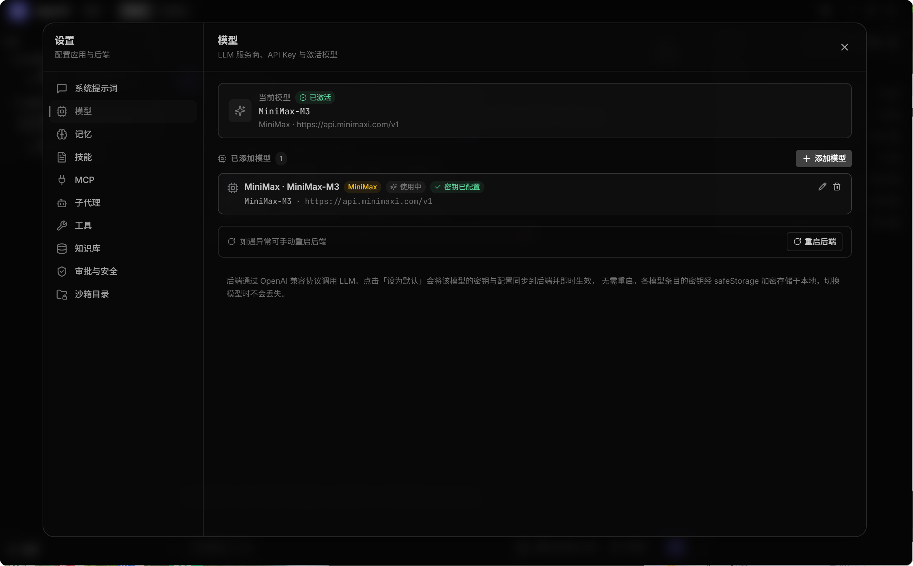

# AgentX

本地优先的个人助理桌面应用，基于 Tauri 2.x + React + FastAPI + LangGraph 构建。
同时提供 **Tauri 桌面 GUI** 与 **终端 CLI** 两种入口，二者配置完全共享。


## 特性

- **双端入口**：[Tauri 桌面 GUI](#快速开始) + [终端 CLI `agentx`](#cli-端支持)，同一份 Tauri store 配置互用
- **场景化多智能体架构**：Work Supervisor（全能） + Coding Expert（专家） + Coding Team（多代理协作） + Subagent（rag / web / 自定义）
- **`agent_mode` 单字段三态**：`work` / `coding` / `coding_team`，Router 按场景直接分发，不再做消息分类
- **人在回路审批**：危险工具 + 目录越界扩展双类型审批，决策 `approve` / `once` / `session` / `deny`；支持 GUI 弹窗 + 终端阻塞输入
- **配置热更新**：Tauri store 持久化 + LRU 缓存清除，配置变更即时生效（无需重启后端）
- **长期记忆**：LangGraph `SqliteSaver` 会话检查点 + 技能 + 画像持久化
- **工具与扩展**：14 项内置工具（filesystem 读写 + grep + glob + web_search + rag_retrieve + git_* + cli_execute）+ RAG 检索 + MCP 协议（stdio / sse / streamable_http）+ 自定义子代理
- **观测**：LangSmith trace + Langfuse + loguru 结构化日志

## CLI 端支持

`agentx` 命令通过 `pyproject.toml` 的 `[project.scripts]` 注册（`agentx = "app.cli:main"`），
`uv sync` 安装后即可在终端直接调用。CLI 与 GUI **复用同一份 Tauri store 配置** 与 **同一套 SSE 事件流**（`run_router` 直连，无需启 HTTP 服务）。

### 安装

CLI 随主项目一起安装：

```bash
uv sync
```

安装成功后自动生成可执行命令：

- Windows：`%USERPROFILE%\.local\bin\agentx.exe`
- POSIX：`~/.local/bin/agentx`

> 不需要 Tauri 桌面端运行，但需先在 GUI 中完成一次配置（API Key、模型等），CLI 即可复用同一份凭证。

### 使用模式

| 模式 | 命令 | 说明 |
|---|---|---|
| REPL 交互 | `agentx` | 持续对话，输入 `/quit` 退出 |
| One-shot | `agentx "写一个快速排序"` | 单次任务直接输出结果后退出 |
| 管道输入 | `git diff \| agentx "写 commit message"` | stdin 自动拼接到消息正文后 |

### 模式选择

`agent_mode` 默认 `coding`，可通过参数切换：

| 参数 | agent_mode | 适用场景 |
|---|---|---|
| `--coding` | `coding` | 默认：单 Coding Expert 处理代码任务 |
| `--work` | `work` | Work Supervisor：行程规划 / 通用问答 / 工具组合 |
| `--coding-team` | `coding_team` | AgentTeam 多代理协作（Orchestrator + 并行 Expert + Blackboard + Aggregator） |

### 常用选项

| 选项 | 说明 |
|---|---|
| `--thread <id>` | 复用已有会话 ID（跨命令保持上下文） |
| `-w, --workspace <path>` | 绑定 workspace 绝对路径 |
| `-v, --verbose` | 显示 reasoning 思考过程与完整 tool_result |
| `--json` | JSON 结构化输出（供脚本解析，事件列表一次性输出） |
| `--version` | 查看版本 |

### REPL 内建命令

进入 REPL 后（输入 `/help` 随时查看）：

| 命令 | 说明 |
|---|---|
| `/help` | 显示可用命令 |
| `/reset` | 清空当前会话历史（通过 checkpointer `adelete_thread`） |
| `/mode <work\|coding\|coding_team>` | 切换 agent_mode |
| `/quit`（`/q`） | 退出 |

### 审批交互

CLI 收到 `approval_request` 事件时阻塞等待终端输入：

```
Approve? [y=批准 / n=拒绝 / o=仅一次 / s=会话级]:
```

输入 `y` / `n` / `o` / `s` 提交决策，与 GUI 审批共享同一份 [app.approval.state](file:///d:/java/agentprojects/agentx/backend/app/approval/state.py)。
见 [cli.py::_handle_approval](file:///d:/java/agentprojects/agentx/backend/app/cli.py)。

### 配置来源

CLI 启动时按以下优先级加载配置：

1. **Tauri store**（`%APPDATA%/agentx/config.json` / `~/.config/agentx/config.json`）—— 与 GUI **共享**，
   自动解密 `enc:` 凭证（OSCrypt v10：DPAPI + AES-256-GCM），映射为 `AGENTX_*` 环境变量；
   实现见 [cli_store.py](file:///d:/java/agentprojects/agentx/backend/app/cli_store.py)
2. **系统环境变量** —— 用户手动 `export AGENTX_*` 的值优先级最高（`apply_config_to_env` 不会覆盖已有值）
3. **当前目录 `.env`** —— CLI 专属降级路径（仅在 Tauri store 不存在时生效）

凭证格式：
- `plain:<value>` → 剥离前缀
- 裸字符串 → 明文直接使用
- `enc:<base64>` → Chromium OSCrypt v10 解密

### 示例

```bash
# REPL 模式
agentx
> 你好
你好！...
> /quit

# One-shot 写代码
agentx "用 Python 写一个快速排序"

# 管道输入
git diff | agentx "根据 diff 写 commit message"

# Work 模式规划行程
agentx --work "帮我规划周末杭州行程"

# 团队协作
agentx --coding-team "重构用户模块"

# JSON 输出供脚本解析
agentx "生成 10 个测试用例" --json > cases.json

# 复用会话（跨命令保持上下文）
agentx --thread abc123 "继续上个对话"
```

## 技术栈

| 层 | 技术 |
|---|---|
| 桌面壳 | Tauri 2.x + Rust 1.77+（tokio async runtime） |
| 前端 UI | React 18 + TypeScript + Tailwind CSS v4 + zustand |
| 主进程 | Rust（10 个官方插件 + `commands/<domain>.rs`） |
| 后端 API | FastAPI + Uvicorn |
| **CLI 端** | **`backend/app/cli.py` + `cli_render.py` + `cli_store.py`（直连 `run_router`，复用 GUI 的 SSE 事件流）** |
| AI 编排 | LangGraph `StateGraph` + DeepAgents + LangChain |
| 智能体分层 | `agents/{supervisor,expert,team}/` 场景化执行体 + `subagents/` 轻量子代理 |
| 向量存储 | Milvus（TEI BGE-M3） |
| 检查点 | LangGraph `SqliteSaver` / `AsyncSqliteSaver` |
| 观测 | LangSmith + Langfuse + loguru |
| 依赖管理 | 前端 npm + Vite 5，Rust cargo，后端 uv + pyproject.toml |

## 快速开始

### 环境要求

- Node.js >= 20
- Python >= 3.11
- uv（Python 包管理器）
- Rust stable（>= 1.77）+ Cargo
- WebView2 Runtime（Windows，Edge 自动安装）

### 安装依赖

```bash
npm install
uv sync
```

### 开发模式（Tauri GUI）

```bash
npm run dev          # 等价于 tauri dev（vite renderer + Rust 主进程 + Python 后端）
```

入口永远走 `npm run dev`，**不要**直接 `uv run python -m app.main`——
`AGENTX_*` 凭证 + 配置由 Rust 主进程通过
[backend/env.rs::build_env](file:///d:/java/agentprojects/agentx/src-tauri/src/backend/env.rs) 注入。
重启 SOP 见 [AGENTS.md §14.7](file:///d:/java/agentprojects/agentx/AGENTS.md#147-重启前后端踩坑沉淀)。

### CLI 端使用

```bash
uv sync                   # 安装后自动注册 agentx 命令
agentx                    # 进入 REPL
agentx "提问内容"          # One-shot
```

CLI 端独立运行，不需要 Tauri 主进程；但需要 GUI 已配置好 API Key（凭证共享 Tauri store）。

### 测试

```bash
npm run test                              # 前端（vitest）
cd src-tauri && cargo test --lib          # Rust 单测
pwsh scripts/smoke-tauri.ps1              # Tauri 迁移冒烟脚本
uv run pytest tests/python/unit -v        # Python 单元测试
uv run pytest tests/python/integration -v -m requires_myserver   # 集成测试（需 myserver 连通性）
```

### 构建

```bash
npm run build        # 等价于 tauri build（生成 NSIS 安装包）
npm run dist:win     # 显式 Windows 目标
```

## 架构与运行模式

### Router 场景分发

聊天主入口 [backend/app/router/graph.py::run_router](file:///d:/java/agentprojects/agentx/backend/app/router/graph.py)
按 `agent_mode` **直接分发**到对应场景执行体（不再做消息分类），CLI 与 GUI **共用此入口**：

| `agent_mode` | 执行体 | 文件 |
|---|---|---|
| `"work"` | `run_work_supervisor`（全能 Supervisor，可委派 Expert / 子代理） | [agents/supervisor/work_supervisor.py](file:///d:/java/agentprojects/agentx/backend/app/agents/supervisor/work_supervisor.py) |
| `"coding"` | `run_coding_expert`（基于 `build_deep_agent` + 审批） | [agents/expert/coding.py](file:///d:/java/agentprojects/agentx/backend/app/agents/expert/coding.py) |
| `"coding_team"` | `run_coding_team`（Orchestrator + 并行 Expert + Blackboard + Aggregator） | [agents/team/coding_team.py](file:///d:/java/agentprojects/agentx/backend/app/agents/team/coding_team.py) |

`run_router` 公共职责：`@skill:<name>` 解析 → workspace 授权同步 →
用户画像加载 → checkpointer 历史读取并截断 → 按 `agent_mode` 分发 →
统一收口 assistant token 写回 checkpointer 并 yield `done`。

### Subagent 与委派

`backend/app/subagents/` 提供基础子代理（被 Supervisor / Coding Expert 调用）：

- **基础子代理**：`rag` / `web`（只读 / 安全工具，禁用 `FORBIDDEN_SUBAGENT_TOOLS`）
- **自定义子代理**：[custom_agent.py](file:///d:/java/agentprojects/agentx/backend/app/subagents/custom_agent.py) 提供工厂函数，可由用户在「设置 → 子代理」配置
- **Supervisor 委派能力**：
  - `delegate_to_expert(expert_name, task, context)` — 委派 Coding Expert
  - `delegate_to_subagent(agent_name, task)` — 委派 rag / web / 自定义子代理
- **`@mention` 语法**（`@coding` / `@rag` / `@web`）强制委派，覆盖 LLM 自主决策；解析在
  [agents/supervisor/mention.py](file:///d:/java/agentprojects/agentx/backend/app/agents/supervisor/mention.py)

Coding Team 角色团：`frontend_dev` / `backend_dev` / `tester` / `architect` / `devops` / `ui_designer` / `product_manager`。
Orchestrator 把任务拆分成子任务计划（`team_plan` 事件），`scheduler.py` 并行执行（`team_progress`），
结果写入 Blackboard（`team_result`），最后由 `aggregator.py` 综合输出（`team_done`）。
写 / 编辑 / shell 等危险任务必须分配为 `code` 子任务，由 Coding Expert 执行并走审批。

### 危险工具审批

`DANGEROUS_TOOLS = {"edit_file", "write_file", "shell_exec", "cli_execute",
"git_clone", "git_pull", "git_checkout", "git_stage", "git_commit"}`
在 Supervisor 与 Coding Expert 中通过 LangGraph `interrupt_before=["tools"]` 触发审批；基础子代理（rag / web）
与自定义子代理**严禁**直接暴露写工具（`FORBIDDEN_SUBAGENT_TOOLS`，见
[config/subagents.py](file:///d:/java/agentprojects/agentx/backend/app/config/subagents.py)）。

审批类型：

- `dangerous_tool`：危险工具调用（默认类型）
- `directory_extension`：路径越界扩展授权（payload 含 `requestedPath` + `writable`）

交互方式（同一份 `app.approval.state` 跨 GUI / CLI）：

- **GUI**：前端 ApprovalRequestModal 弹窗
- **CLI**：终端阻塞输入 `y/n/o/s`，见 [cli.py::_handle_approval](file:///d:/java/agentprojects/agentx/backend/app/cli.py)

流控制端点（[api/chat.py](file:///d:/java/agentprojects/agentx/backend/app/api/chat.py)）：
`POST /api/chat/{approve,abort,pause,resume,compact}`。

### SSE 事件契约

事件 discriminated union 定义见
[shared/api-types.ts::ChatEvent](file:///d:/java/agentprojects/agentx/frontend/shared/api-types.ts)，
后端构造器 [utils/sse_events.py](file:///d:/java/agentprojects/agentx/backend/app/utils/sse_events.py)，
后端流式分发 [api/chat.py::_event_generator](file:///d:/java/agentprojects/agentx/backend/app/api/chat.py)，
**CLI 渲染** [cli_render.py](file:///d:/java/agentprojects/agentx/backend/app/cli_render.py)，
前端解析 [useChatStream.ts](file:///d:/java/agentprojects/agentx/frontend/renderer/hooks/useChatStream.ts)。

主要事件：`token` / `reasoning` / `tool_call` / `tool_result` / `delegation` /
`todo_update` / `plan` / `plan_update` / `approval_request` / `paused` /
`team_plan` / `team_progress` / `team_result` / `team_done` / `done` / `error`。

`source` 字段标识：`work` / `coding` / `rag` / `web`。

修改任一事件类型或字段名，**必须**同步更新以下五处：

- [api/chat.py](file:///d:/java/agentprojects/agentx/backend/app/api/chat.py)（事件 yield）
- [utils/sse_events.py](file:///d:/java/agentprojects/agentx/backend/app/utils/sse_events.py)（构造器）
- [cli_render.py](file:///d:/java/agentprojects/agentx/backend/app/cli_render.py)（**CLI 渲染**）
- [shared/api-types.ts](file:///d:/java/agentprojects/agentx/frontend/shared/api-types.ts)（类型契约）
- [useChatStream.ts](file:///d:/java/agentprojects/agentx/frontend/renderer/hooks/useChatStream.ts)（前端解析）

## 配置



配置通过前端设置面板实时保存，由 Rust 主进程通过 tauri-plugin-store 持久化
（凭证用 `enc:` / `plain:` 前缀格式）并注入后端进程，**CLI 端复用同一份 store**，
无需手动编辑 `.env`：

- **模型**：LLM 服务商（OpenAI / DeepSeek / MiniMax / Kimi / GLM / 自定义）、API Key、激活模型
- **记忆**：系统提示词、上下文窗口（消息数 / token 上限）、技能、画像、会话
- **技能**：Markdown 技能文件管理（消息中 `@skill:<name>` 触发注入）
- **MCP**：MCP server 配置与工具发现（支持 stdio / sse / streamable_http 三种传输）
- **子代理**：基础子代理（rag / web）开关与参数、AgentTeam 7 角色、自定义子代理
- **工具**：14 项内置工具的启用状态
- **知识库**：Milvus 连接配置 + 嵌入服务（TEI BGE-M3）
- **审批与安全**：自动审批倒计时、审批最长等待、沙箱授权目录、权限模式（`standard` / `full_trust`）

**配置变更即时生效**（无需重启后端）：
Renderer 保存配置 → `invoke("settings_set_*")` → tauri-plugin-store
→ `invoke("app_reload_backend_config")` → Rust 主进程从 store 读最新配置
→ `POST /api/config/reload` → 后端 `reload_settings()` 清除 `lru_cache`。
MCP 配置变更额外触发 `get_mcp_manager().refresh()` 重连。

CLI 端无独立配置文件；启动时由 [cli_store.py::apply_config_to_env](file:///d:/java/agentprojects/agentx/backend/app/cli_store.py)
读取 Tauri store 并映射为 `AGENTX_*` 环境变量，与 GUI 完全等价。

如遇异常可手动「重启后端」（`invoke("app_restart_backend")`，仅重启 Python 进程）。
全量重启 Tauri（`invoke("app_restart")`）仅用于 ErrorBoundary 渲染错误恢复。

### 从旧版 Electron 迁移

首次启动 Tauri 版本时，`migration::migrate_electron_store()` 会自动检测旧 Electron
配置文件（`%APPDATA%/agentx/config.json`）并迁移到 tauri-plugin-store。明文配置
（`plain:` 前缀或裸字符串）自动迁移；`enc:` 加密凭证（safeStorage）无法跨进程解密，
会在前端设置页提示用户重新输入。