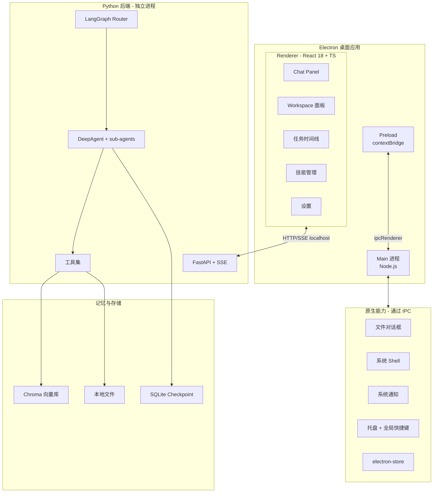
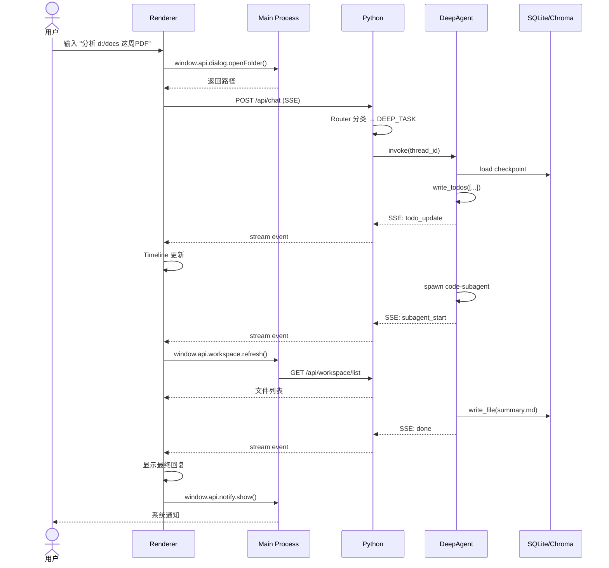

# 个人助理 Agent — 设计文档

> **状态**：草案 v2 · 待用户 review
> **创建日期**：2026-07-03
> **最后更新**：2026-07-03

---

## 1. 概述

### 1.1 项目定位
本地优先的个人助理桌面应用，对标 **Tencent WorkBuddy** 与 **Alibaba QoderWork**。用户在自然语言中描述任务，应用通过多 Agent 协作自主规划、执行并交付结果。

### 1.2 核心场景
通用全能型：开发辅助、知识/学习、信息检索（不含邮件/日程/联系人）。

### 1.3 形态
- **Electron + React 桌面应用**（M1 本地开发，M2 打包成 Windows 安装包）
- 后端为 **Python 进程**（M1 子进程调用，M2 PyInstaller 嵌入）
- 通过 **localhost HTTP + SSE** 通信

### 1.4 设计原则
- **避免造轮子**：所有选型优先主流、社区活跃、有商业项目背书
- **多模型可换**：LLM 通过 `init_chat_model` 统一入口，支持 OpenAI / Anthropic / DashScope / DeepSeek / Ollama 等
- **本地优先**：数据落本地 SQLite + Chroma，敏感文件不出本机
- **人机协同**：危险操作（`edit_file` / `write_file`）走 `interrupt_on` 暂停等用户批准

---

## 2. 目标与非目标

### 2.1 目标
- ✅ 提供 workbuddy / qoderwork 风格的"自然语言→执行→交付"桌面体验
- ✅ 支持单轮闲聊、单步工具任务、复杂多步规划任务 三类路由
- ✅ 代码/文件操作、文档 RAG、联网检索 三大类工具
- ✅ 跨会话长期记忆与技能加载
- ✅ LangSmith 全链路追踪
- ✅ M2 输出可分发的 Windows 安装包

### 2.2 非目标（M1 不做）
- ❌ 多用户/多租户
- ❌ 移动端（iOS/Android）
- ❌ 邮件/日历/联系人集成（M1）
- ❌ IM 通道（钉钉/飞书/Telegram，M2 末尾可选）
- ❌ 多语言界面（M1 仅中文）
- ❌ 插件市场（M3+）
- ❌ 本地 LLM（M1 不做；M3+ 评估）

---

## 3. 架构

### 3.1 分层架构



### 3.2 三条执行路径

| 路径 | 判定信号 | 工具集 | 上下文 | 延迟预期 |
|---|---|---|---|---|
| **A · 闲聊/简单问答** | 问候、定义、简单事实、单句意图 | 0 工具，纯 chat() | 仅本轮 | < 1s |
| **B · 中等任务** | 单步工具调用可完成（"查下今天天气" "读这个文件"） | 1~3 工具 | 会话历史 | 2~5s |
| **C · 复杂任务** | 需多步规划、需派 sub-agent、需持久化中间产物 | DeepAgent 全套 + 虚拟文件系统 + sub-agent 派生 | 完整 + 自动 offload | 10s~数分钟 |

**判定方式**：
- 首选：用 `gpt-4o-mini` / `qwen-turbo` 跑 1~2 token 的分类 prompt，输出 `CHAT | SINGLE_TOOL | DEEP_TASK` 三分类
- 兜底：消息含"分析"/"总结"/"审计"/"处理 X 个"等关键词直接走 C
- 用户指令：Chat 输入框内 `/reset` 重新派发，`/deep` 强制走 C，`/simple` 强制走 A

---

## 4. 技术栈

### 4.1 前端（Electron + React）

| 类别 | 选型 | 版本约束 | 理由 |
|---|---|---|---|
| 桌面框架 | Electron | >= 32 | 跨平台主流 |
| 构建工具 | electron-vite | latest | Vite 集成 HMR、模板完整 |
| UI 框架 | React + TypeScript | 18+ / 5+ | 主流 |
| 样式 | Tailwind CSS | v4 | 原子化主流 |
| 组件库 | shadcn/ui + Radix UI | latest | 可复制粘贴、风格现代 |
| 状态管理 | Zustand | 4+ | 比 Redux 轻、TypeScript 友好 |
| 异步数据 | TanStack Query | 5+ | SSE/重试/缓存一把梭 |
| 路由 | React Router | 6+ | 主流 |
| Markdown | react-markdown + shiki | latest | 代码高亮主流 |
| 任务流可视化 | @xyflow/react | 12+ | 适合画 LangGraph 风格图 |
| 表单 | react-hook-form + zod | latest | 主流 |
| 动画 | framer-motion | 11+ | 主流 |
| 图标 | lucide-react | latest | 主流 |

### 4.2 Electron 主进程

| 类别 | 选型 | 备注 |
|---|---|---|
| 进程通信 | `ipcMain` + `contextBridge` | 安全最佳实践 |
| 配置存储 | electron-store | 官方推荐 |
| 窗口 | 多 `BrowserWindow` | chat 主 + workspace 辅 |
| 系统托盘 | `Tray` | M2 启用 |
| 全局快捷键 | `globalShortcut` | Ctrl+Space 唤起，M2 启用 |
| 文件对话框 | `dialog` | M1 启用 |
| 通知 | `Notification` | M1 启用 |
| 剪贴板 | `clipboard` | M1 启用 |
| 自动启动 | `app.setLoginItemSettings` | M2 启用 |
| 打包 | electron-builder | M2 启用 |
| 自动更新 | electron-updater | M2 启用 |

### 4.3 后端（Python）

| 类别 | 选型 | 备注 |
|---|---|---|
| Agent 框架 | deepagents + langgraph | 主体 |
| LLM 抽象 | langchain.chat_models.init_chat_model | 多 provider |
| 嵌入模型 | BAAI/bge-m3（sentence-transformers） | 中文强 |
| 向量库 | Chroma | 嵌入式零依赖 |
| Checkpoint | langgraph-checkpoint-sqlite | 单机 |
| Web 框架 | FastAPI + uvicorn | 高性能异步 |
| 流式输出 | sse-starlette | SSE |
| 可观测 | LangSmith + loguru | 追踪 + 结构化日志 |
| 沙箱执行 | DeepAgents FilesystemBackend | 真实磁盘，限路径 |

---

## 5. 目录结构

```
agent-py/
├── package.json                # Node/Electron 依赖
├── pyproject.toml              # Python 依赖
├── electron.vite.config.ts     # electron-vite 配置
├── tailwind.config.ts
├── tsconfig.json
├── components.json             # shadcn/ui 配置
├── .env.example
├── .gitignore
│
├── src/                        # 前端（Electron + React）
│   ├── main/                   # Main 进程
│   │   ├── index.ts
│   │   ├── window/             # 窗口管理
│   │   ├── python/             # Python 子进程
│   │   ├── ipc/                # IPC handlers
│   │   ├── tray.ts
│   │   ├── menu.ts
│   │   ├── shortcut.ts
│   │   ├── store.ts
│   │   └── updater.ts
│   ├── preload/
│   │   └── index.ts
│   └── renderer/
│       ├── index.html
│       ├── main.tsx
│       ├── App.tsx
│       ├── routes/             # React Router
│       ├── components/
│       │   ├── ui/             # shadcn/ui 基础组件
│       │   ├── chat/           # ChatPanel, MessageList, InputBar
│       │   ├── workspace/      # FileTree, Editor, Preview
│       │   ├── timeline/       # TaskTimeline, SubagentGraph
│       │   ├── skills/         # SkillsList, SkillEditor
│       │   └── settings/       # ModelConfig, PathConfig
│       ├── hooks/              # useChat, useTasks, useElectron
│       ├── stores/             # Zustand: chat, tasks, settings
│       ├── lib/                # API client, utils, ipc
│       └── styles/             # Tailwind
│
├── app/                        # Python 后端
│   ├── __init__.py
│   ├── main.py                 # FastAPI 入口
│   ├── config.py               # Pydantic Settings
│   ├── router/
│   │   ├── __init__.py
│   │   ├── classifier.py       # 消息分类器
│   │   ├── state.py            # RouterState TypedDict
│   │   └── graph.py            # LangGraph Router 编排
│   ├── paths/
│   │   ├── __init__.py
│   │   ├── chat_path.py        # 路径 A：直接 chat()
│   │   ├── react_path.py       # 路径 B：ReAct Agent
│   │   └── deep_path.py        # 路径 C：DeepAgent
│   ├── tools/
│   │   ├── __init__.py
│   │   ├── filesystem.py       # 受限 read/write/glob/grep
│   │   ├── git_ops.py
│   │   ├── web_search.py       # Tavily / DuckDuckGo
│   │   ├── web_fetch.py        # Jina Reader / httpx
│   │   └── rag_retrieve.py     # Chroma 检索
│   ├── subagents/
│   │   ├── __init__.py
│   │   ├── code_subagent.py    # 文件系统 + git
│   │   ├── rag_subagent.py     # 文档检索
│   │   └── web_subagent.py     # 联网搜索
│   ├── memory/
│   │   ├── __init__.py
│   │   ├── checkpointer.py
│   │   ├── long_term.py
│   │   └── skills_loader.py
│   ├── observability/
│   │   ├── __init__.py
│   │   ├── langsmith.py
│   │   └── logger.py
│   └── utils/
│       ├── __init__.py
│       ├── security.py         # 路径/命令白名单
│       └── chunks.py           # 长消息切片
│
├── data/                       # 运行时（gitignored）
│   ├── chroma/
│   ├── workspace/              # agent 沙箱
│   ├── uploads/                # 用户拖入文件
│   └── agent-py.db
│
├── tests/
│   ├── python/                 # pytest
│   ├── renderer/               # vitest + testing-library
│   ├── e2e/                    # playwright（M2）
│   └── evals/                  # LangSmith 评测
│
└── docs/
    └── superpowers/
        ├── specs/              # 设计文档
        └── plans/              # 实施计划
```

---

## 6. 关键数据流（一条任务）



---

## 7. IPC 桥（preload 暴露给 renderer）

```typescript
// window.api 接口契约
interface ElectronAPI {
  // Python 后端通信
  chat: {
    send: (msg: ChatMessage, opts?: { threadId?: string; signal?: AbortSignal }) => Promise<void>;
    abort: (threadId: string) => Promise<void>;
    onEvent: (handler: (event: ChatEvent) => void) => () => void;
  };
  tasks: {
    list: () => Promise<Task[]>;
    get: (taskId: string) => Promise<Task>;
    cancel: (taskId: string) => Promise<void>;
  };
  skills: {
    list: () => Promise<Skill[]>;
    enable: (skillId: string) => Promise<void>;
    disable: (skillId: string) => Promise<void>;
    run: (skillId: string, input: unknown) => Promise<unknown>;
  };

  // 原生能力
  dialog: { openFile: (opts?: OpenDialogOptions) => Promise<string[]>; openFolder: () => Promise<string[]>; saveFile: (opts?: SaveDialogOptions) => Promise<string | null> };
  shell: { openInEditor: (path: string) => Promise<void>; revealInFolder: (path: string) => Promise<void>; openExternal: (url: string) => Promise<void> };
  notify: { show: (title: string, body: string) => Promise<void> };
  clipboard: { read: () => Promise<string>; write: (text: string) => Promise<void> };
  app: { getVersion: () => string; getPath: (name: PathName) => string; quit: () => void; restart: () => void };
  updater: { check: () => Promise<void>; install: () => Promise<void>; onProgress: (h: (p: number) => void) => () => void };
}
```

---

## 8. UI 布局（workbuddy / qoderwork 风）

```
┌─────────────────────────────────────────────────────────────┐
│  [≡] AgentPy            🔍 搜索            ⚙ 设置  👤   │  顶栏
├──────────┬──────────────────────────────┬─────────────────┤
│          │                              │                 │
│  会话     │   Chat Panel                 │   Workspace     │
│  列表     │   (主交互区)                  │   面板          │
│          │                              │                 │
│  ▢ 会话1 │   👤 "分析 d:/docs 这周..."    │   📁 data/      │
│  ▢ 会话2 │   🤖 [规划中...write_todos]   │     ├ 📂 docs   │
│  ▢ 会话3 │       ▢ 扫描 PDF              │     ├ 📂 out    │
│          │       ▢ 提取关键信息           │     └ 📝 summary│
│  + 新建   │       ▢ 生成摘要              │                 │
│          │   🤖 "已完成，文件已保存"      │   [编辑器]       │
│          │                              │                 │
├──────────┴──────────────────────────────┴─────────────────┤
│  [输入框: 拖入文件 / @技能 / 输入]              [发送]      │  底部
└─────────────────────────────────────────────────────────────┘
```

**布局要点**：
- 三栏：会话列表 / Chat / Workspace
- Chat 实时显示任务时间线（write_todos 进度）
- Workspace 实时显示 agent 写入的文件
- 拖拽文件到输入框
- `@` 触发技能/子代理选择

---

## 9. 关键决策

| # | 维度 | 选择 | 备选 | 理由 |
|---|---|---|---|---|
| D1 | 前端构建 | electron-vite | electron-forge | HMR 快、模板全 |
| D2 | 组件库 | shadcn/ui + Radix | Ant Design | 可复制粘贴改、不锁定 |
| D3 | 状态管理 | Zustand | Redux Toolkit | 更轻、TS 友好 |
| D4 | 异步层 | TanStack Query | SWR | SSE/重试/缓存一把梭 |
| D5 | Python↔Electron | localhost HTTP + SSE | stdio JSON-RPC | 易调试、易接入 LangGraph |
| D6 | 窗口策略 | 多 BrowserWindow | 单窗口 + tabs | 模拟 workbuddy |
| D7 | 嵌入模型 | BAAI/bge-m3 | OpenAI text-embedding-3 | 中文强、本地可跑 |
| D8 | Checkpointer | SQLite | Postgres | 起步零依赖，可平迁 |
| D9 | 向量库 | Chroma | Qdrant / Pinecone | 嵌入式零依赖 |
| D10 | 后端集成 | M1 子进程 / M2 PyInstaller | 远端服务器 | M1 快速开发 |
| D11 | 安全 | contextIsolation=true + preload 桥 | nodeIntegration | Electron 最佳实践 |
| D12 | 危险工具 | interrupt_on 暂停等批准 | 完全自动 | 安全 + 透明 |

---

## 10. 错误处理与韧性

| 失败场景 | 处理策略 |
|---|---|
| LLM API 超时/限流 | tenacity 重试 3 次（指数退避）+ 失败回退到次选模型 |
| 分类器误判 | 用户 `/reset` 重新派发；`/deep` 强制走 C |
| DeepAgent sub-agent 超时 | 60s 硬超时 + 中间产物落盘，用户可续跑 |
| Python 进程崩溃 | Main 进程自动重启 + 系统通知 |
| Chroma 索引损坏 | 启动时自检 + 自动重建空索引 |
| 工具抛异常 | DeepAgent 自动捕获并写入 state；显式错误回显到 Chat |
| Electron 主进程崩溃 | `app.on('render-process-gone')` 监听 + 提示用户 |

---

## 11. 测试策略

| 层级 | 工具 | 覆盖 |
|---|---|---|
| Python 单元 | pytest | 分类器、工具函数、消息切片、安全白名单 |
| Python 集成 | pytest + httpx.AsyncClient | 端到端 3 条路径 |
| Renderer 单元 | vitest + @testing-library/react | 组件、hooks、stores |
| Renderer 组件 | Storybook（M2） | UI 视觉回归 |
| E2E | playwright（M2） | 启动→聊天→文件落盘 |
| 场景评测 | LangSmith Datasets | 闲聊/中等/复杂各 5 例 |

**冒烟要求**：每改 router 或工具 → 必跑 `tests/python/integration/test_smoke.py` 与 `tests/renderer/smoke.test.tsx`

---

## 12. 安全

- **Electron 安全三件套**：`contextIsolation: true`、`nodeIntegration: false`、`sandbox: true`（preload 例外）
- **CSP 策略**：渲染层 `Content-Security-Policy` 禁止外联脚本
- **路径白名单**：DeepAgent 沙箱仅可读写 `data/workspace/`、`data/uploads/`
- **命令白名单**：受控 shell 命令列表（git status/diff/log/commit 等）
- **API Key 管理**：通过 Electron 内置 `safeStorage` 加密后存 `electron-store`；不入 .env 明文、不入 git
- **危险操作**：`edit_file` / `write_file` / 任何 shell 命令前 `interrupt_on` 暂停 5s，用户可取消

---

## 13. M1 范围（本地开发版，1~2 周）

### 13.1 M1 必做
- [ ] electron-vite 项目初始化（TypeScript + React 18 + Tailwind v4）
- [ ] shadcn/ui 基础组件引入（Button / Input / ScrollArea / Dialog / Tabs）
- [ ] Zustand + TanStack Query 接入
- [ ] React Router 6 三栏布局骨架
- [ ] FastAPI 后端 v1 代码迁过来（删 IM channels）
- [ ] Main 进程：Python 子进程管理（启动/停止/重启/日志）
- [ ] Preload + IPC 桥（chat/dialog/shell/notify/clipboard）
- [ ] Renderer：ChatPanel + MessageList + InputBar（@技能、拖文件）
- [ ] LangGraph Router 3 路径（chat / react / deep）
- [ ] DeepAgent + code-subagent + rag-subagent（基础版）
- [ ] Chroma + SQLite 持久化
- [ ] LangSmith 追踪
- [ ] 启动：终端 A `python -m app.main`，终端 B `npm run dev`

### 13.2 M1 验收标准
- 输入"早安" → <1s 收到回复（路径 A）
- 输入"读一下 README.md" → ReAct 调 filesystem 工具（路径 B）
- 输入"把 d:/docs 这周所有 PDF 总结成要点" → DeepAgent 规划→执行→写文件（路径 C）
- 三种场景 LangSmith 均有完整 trace
- 主进程崩溃后自动重启

---

## 14. M2 范围（可发布版，+1~2 周）

- [ ] PyInstaller 打包 Python 后端为 exe
- [ ] electron-builder 出 Windows 安装包
- [ ] electron-updater 接入（含签名）
- [ ] 全局快捷键（Ctrl+Space 唤起）
- [ ] 系统托盘 + 菜单
- [ ] Workspace 面板文件树（@xyflow/react 可选）
- [ ] 任务时间线可视化
- [ ] 自动启动开关
- [ ] E2E playwright 测试
- [ ] 飞书/钉钉入口（M2 末尾可选）

---

## 15. 开放问题（待用户决策）

| # | 问题 | 默认假设 |
|---|---|---|
| Q1 | 是否需要登录/账号体系？ | 不需要，本地单用户 |
| Q2 | 是否需要云同步（多设备访问同一 agent）？ | 不需要 |
| Q3 | 文件拖入大小限制？ | 默认 50MB，可配置 |
| Q4 | 日志保留策略？ | 默认 7 天，10MB 滚动 |
| Q5 | 是否支持自定义 system prompt？ | 支持（设置页可编辑） |
| Q6 | 是否暴露 OpenAI 兼容 HTTP API（给其他工具调用）？ | M2 评估 |
| Q7 | 应用名称？默认建议 "AgentPy" | 待用户确认 |

---

## 16. 附录

### 16.1 关键依赖版本基线

```toml
# pyproject.toml
[project]
dependencies = [
  "deepagents>=0.2.0",
  "langgraph>=0.5.0",
  "langchain>=0.3.0",
  "langchain-openai>=0.2.0",
  "fastapi>=0.115.0",
  "uvicorn[standard]>=0.32.0",
  "sse-starlette>=2.1.0",
  "chromadb>=0.5.0",
  "sentence-transformers>=3.0.0",
  "langgraph-checkpoint-sqlite>=2.0.0",
  "pydantic>=2.9.0",
  "pydantic-settings>=2.6.0",
  "tenacity>=9.0.0",
  "loguru>=0.7.0",
  "tavily-python>=0.5.0",
  "httpx>=0.27.0",
]
```

```jsonc
// package.json（核心）
{
  "dependencies": {
    "react": "^18.3.0",
    "react-dom": "^18.3.0",
    "react-router-dom": "^6.27.0",
    "@tanstack/react-query": "^5.59.0",
    "zustand": "^5.0.0",
    "react-markdown": "^9.0.0",
    "shiki": "^1.22.0",
    "@xyflow/react": "^12.3.0",
    "react-hook-form": "^7.53.0",
    "zod": "^3.23.0",
    "framer-motion": "^11.11.0",
    "lucide-react": "^0.456.0",
    "electron-store": "^10.0.0",
    "clsx": "^2.1.0",
    "tailwind-merge": "^2.5.0"
  },
  "devDependencies": {
    "electron": "^32.0.0",
    "electron-vite": "^2.3.0",
    "electron-builder": "^25.0.0",
    "electron-updater": "^6.3.0",
    "typescript": "^5.6.0",
    "vite": "^5.4.0",
    "tailwindcss": "^4.0.0",
    "@vitejs/plugin-react": "^4.3.0",
    "vitest": "^2.1.0",
    "@testing-library/react": "^16.0.0",
    "@testing-library/jest-dom": "^6.5.0",
    "playwright": "^1.48.0"
  }
}
```

### 16.2 启动命令约定

```bash
# M1 开发
# 终端 A：启动 Python 后端
uv run python -m app.main

# 终端 B：启动 Electron
npm run dev

# 终端 C（可选）：跑测试
npm test
```

### 16.3 后续文档

- 实施计划：`docs/superpowers/plans/2026-07-03-agent-py.md`（由 `writing-plans` 技能生成）
- API 契约：随实施过程产出
- 用户手册：M2 末尾产出
